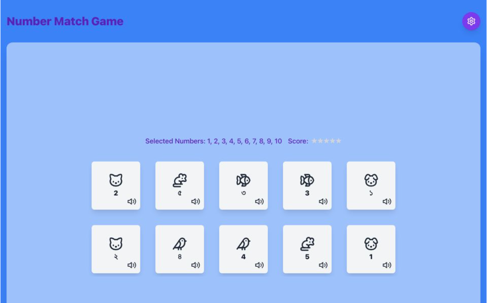

# BanglaABC123

## Overview

The BanglaABC123 is a fun and interactive educational game designed to help users learn numbers in both English and Bengali. The game features a matching mechanic where players must find pairs of cards that match in value. It utilizes React, TypeScript, and Tailwind CSS for a modern and responsive user interface.

## Features

- **Interactive Gameplay**: Players can select cards to find matching pairs.
- **Settings Page**: Customize game settings, including the number of cards and whether to show animal icons and colors.
- **Responsive Design**: The game is fully responsive and works on various screen sizes.
- **Local Storage**: Game settings and state are saved in local storage for a persistent experience.
- **Beautiful UI**: Utilizes Tailwind CSS for styling, ensuring a clean and modern look.

## Technologies Used

- **React**: A JavaScript library for building user interfaces.
- **TypeScript**: A superset of JavaScript that adds static types.
- **Tailwind CSS**: A utility-first CSS framework for styling.
- **Zustand**: A small, fast state-management solution for React.
- **Vite**: A build tool that provides a fast development environment.

## Installation

To get started with the BanglaABC123, follow these steps:

1. Clone the repository:
   ```bash
   git clone https://github.com/yourusername/number-match-game.git
   ```

2. Navigate to the project directory:
   ```bash
   cd number-match-game
   ```

3. Install the dependencies:
   ```bash
   npm install
   ```

4. Start the development server:
   ```bash
   npm run dev
   ```

5. Open your browser and go to `http://localhost:3000` to play the game!

## Usage

- Click on the cards to reveal their values.
- Try to find matching pairs within the given number of attempts.
- Use the settings page to adjust game preferences.

## Contributing

Contributions are welcome! If you have suggestions for improvements or new features, feel free to open an issue or submit a pull request.

## License

This project is licensed under the MIT License. See the [LICENSE](LICENSE) file for details.

## Acknowledgments

- Thanks to the contributors of the libraries and frameworks used in this project.
- Special thanks to Unsplash for providing beautiful stock photos used in the game.

## Contact

For any inquiries, please reach out to [nadimtuhin@gmail.com](mailto:nadimtuhin@gmail.com).

## Screenshot


